# KibbleBot
A 3D printed kibble/trest dispenser powered by a Raspberry Pi Pico. Give your pet a treat even if you're not home!

## Features
- Kibbles dispensed through the push of an button or remotely through a web app
- Easy to print and build
- Minimal electronics
- Happy puppers

## Build Instructions
### Parts List
Before you get started, here are all the things you'll need to buy to build your very own KibbleBot. For reference I've included links to the products I purchased, mainly from Amazon and RobotShop:
1. Raspberry Pi Pico W
1. Easy Driver Stepper Motor Controller
1. NEMA 17 Stepper Motor (12V and 350mA)
1. 12V Power Supply
1. M2x5mm Screws
1. M2 Heat Set Nuts (3.2mm outer diameter)
1. 6x6x4.3mm TACT Switch Push Button
1. 12V DC Barrel Connector (11mm outer diameter) 
1. Solder and wire

### 3D Printed Parts
Print all parts with 0.2mm layer height and 15% infill. I recommend printing both gears with 4 wall loops for some added strength.

I've included [Bambu Studio Project file](docs/models/kibble_bot.3mf) with all parts laid out on two build plates and configured.

|Model|Image|Details|
|-----|-----|-----------|
|[Base Bottom](docs/models/base_bottom.stl)|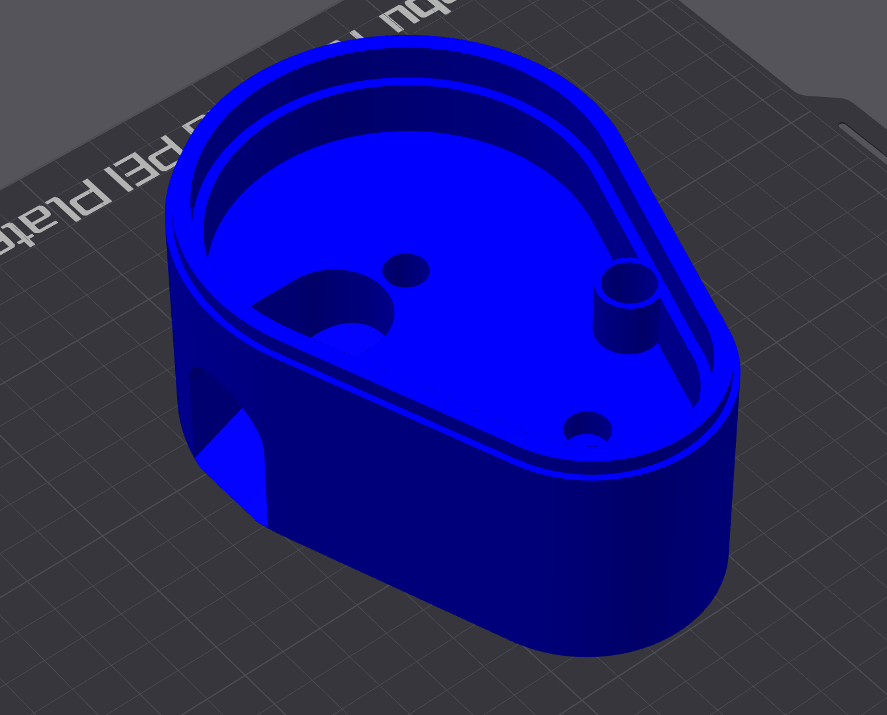|Base of the KibbleBot which the Base Top and Hopper rest on. It has two holes for each gear to rest in and a third for running the stepper motor wire through. It also contains the chute that kibbles come out of and the cut out for the electronics drawer in the back.  **Print Orientation**: Right side up **Quantity**: 1 **Supports**: Yes|
|[Base Top](docs/models/base_top.stl)|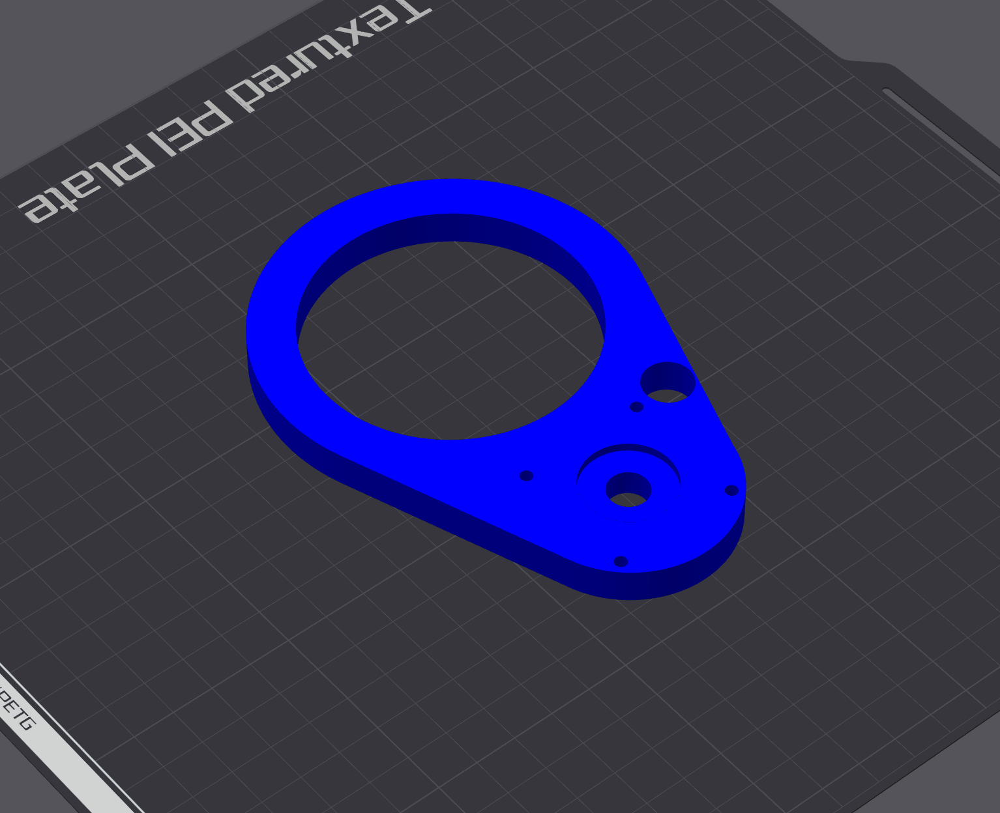|The Base Top sits inside the Base Bottom covering both gears. It has mounting holes in a 31mm pattern to mount the NEMA 17 stepper motor. You may need to drill out the holes with a small drill bit in order to fit the screws in.  **Print Orientation**: Side up down **Quantity**: 1 **Supports**: No|
|[Large Gear Wheel](docs/models/large_gear_wheel.stl)|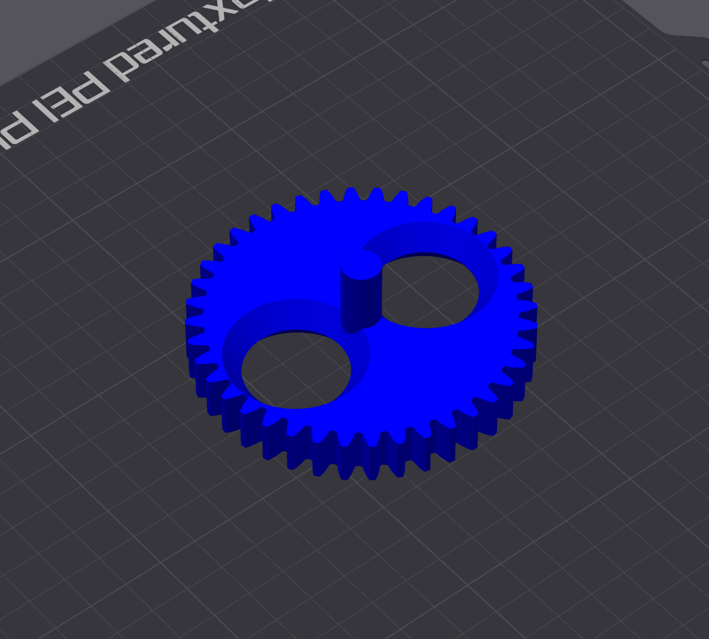|The Large Gear Wheel is spun 180 degrees by the Small Gear Wheel allowing kibbles to fall through it and down the chute in the base bottom. It also has two holes for the optional Stir Sticks if you find that kibbles are getting stuck in the Hopper.  **Print Orientation**: Side up down **Quantity**: 1 **Supports**: No|
|[Small Gear Wheel](docs/models/small_gear_wheel.stl)|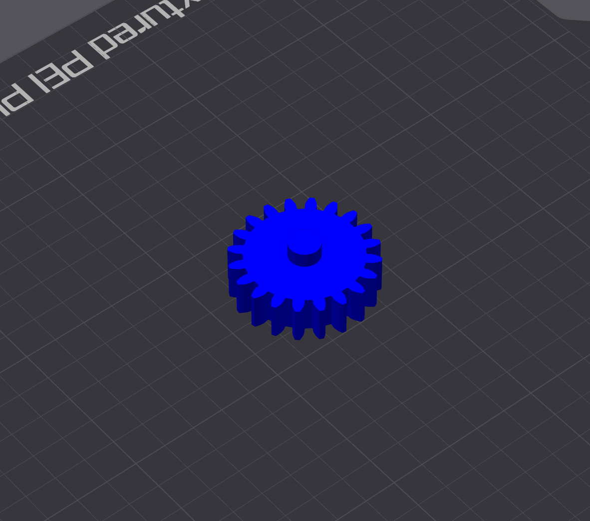|The Small Gear Wheel is connected to the stepper motor and turns the Large Gear Wheel.  **Print Orientation**: Side up down **Quantity**: 1 **Supports**: No|
|[Stir Stick](docs/models/stir_stick.stl) (optional)|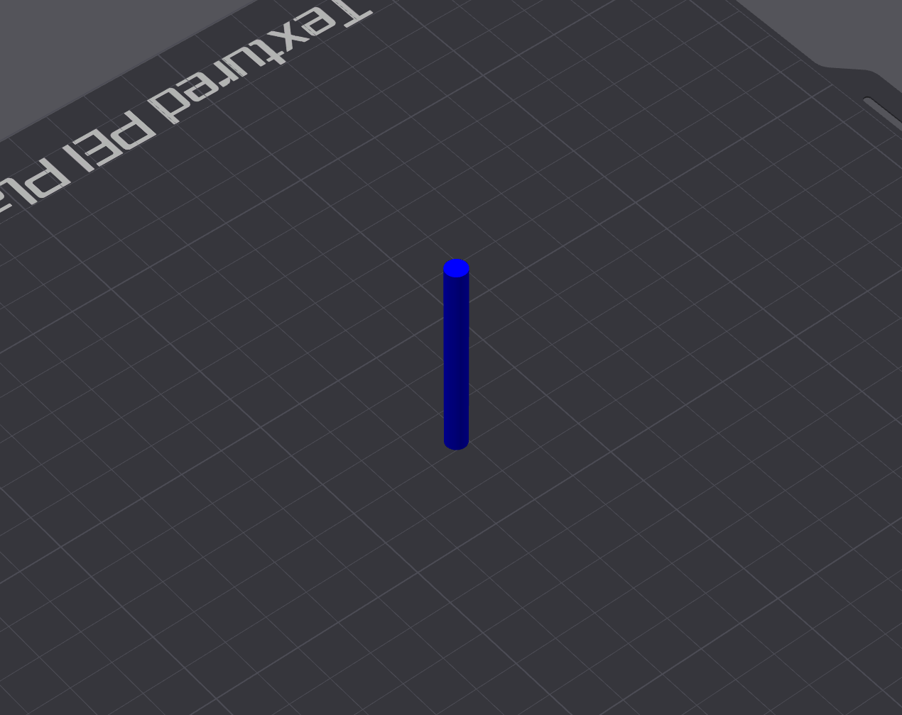|Slots into the top of the Large Gear Wheel and can help with kibbles getting stuck in the Hopper and not flowing through.  **Print Orientation**: Vertical **Quantity**: 2 **Supports**: Yes (brim)|
|[Hopper](docs/models/hopper.stl)|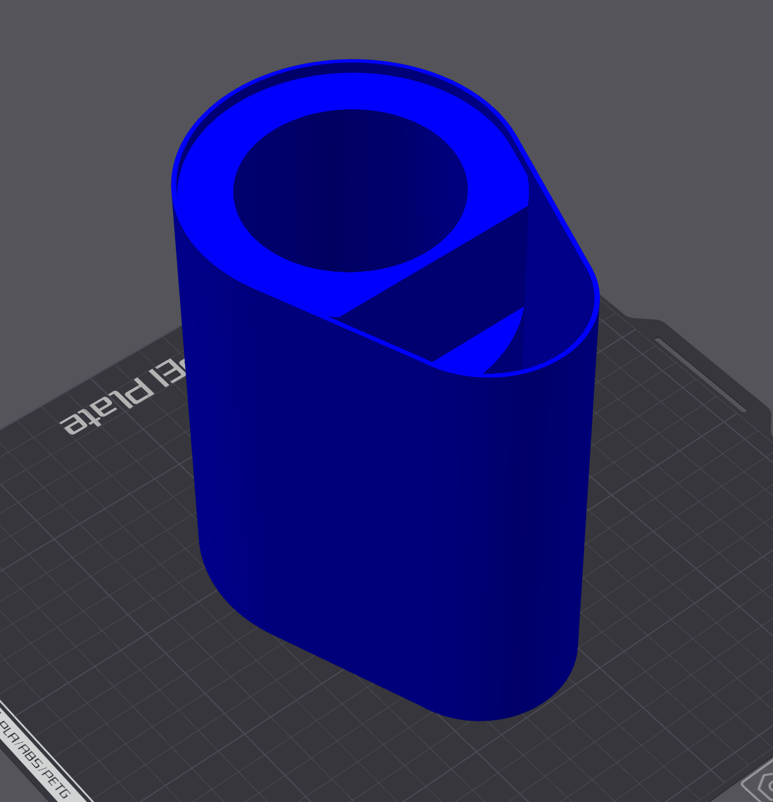|The Hopper sits on top of the Base Bottom and holds kibbles to be dispensed. Contains a cut out so that it will fit over the stepper motor.  **Print Orientation**: Up side down **Quantity**: 1 **Supports**: No|
|[Lid](docs/models/lid.stl)|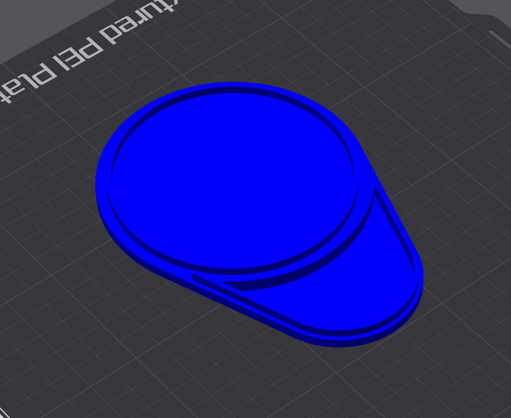|Sits on top of the Hopper to close it off.  **Print Orientation**: Up side down **Quantity**: 1 **Supports**: No|
|[Electronics Housing](docs/models/electronics_housing.stl)|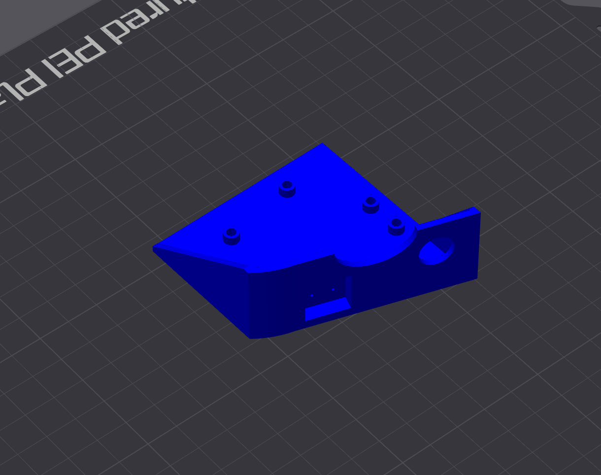|Houses the Raspberry Pi Pico and the Easy Driver with four holes for the M2 heat set nuts to mount both boards. Also has cut outs for the barrel connector to pass through and to mount the button.  **Print Orientation**: Right side up **Quantity**: 1 **Supports**: Yes|
|[Key Cap](docs/models/key_cap.stl)|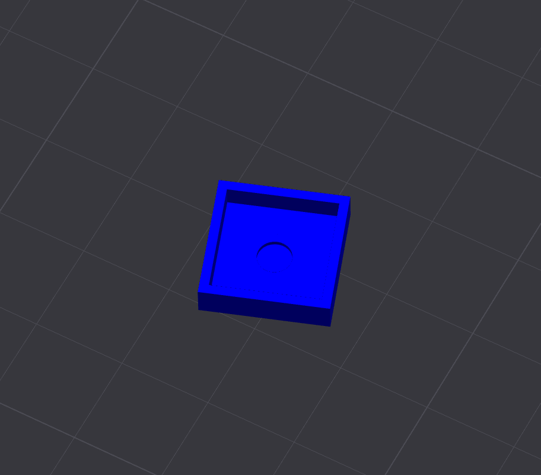|The Key Cap is glued on top of the TACT Button and fits inside of a recessed compartment in the Electronics Housing.  **Print Orientation**: Up side down **Quantity**: 1 **Supports**: No|

### Assembly
The 3D printed parts are assembled together like so:

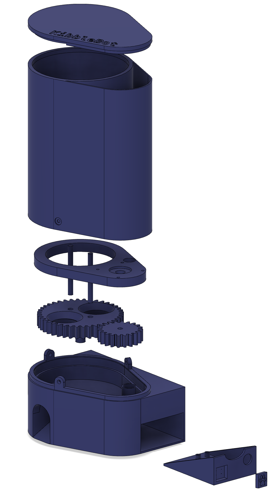

### Electronics
Since the Pico uses 3.3V logic, the first thing you should do is switch the Easy Driver to use 3.3V logic as well by soldering SJ2 closed (placing a small glob of solder on the two pads on the bottom left hand corner of the board where it's written "5V/3V"). You can confirm you've done this correctly by measing the voltage across the +5V Output and GND, which shoul now be 3.3V.

Next, wire the Easy Driver to the Pico as follows:
1. DIR -> GP15
1. STEP -> GP14
1. GND -> GND (Pin 18)
1. SLP -> GP13

Connect one side of the TACT Button to GP10 and the other to ground (Pin 13). I used a little bit of CA glue on the back of the button to glue it to the electronics housing, as well as some glue on the back of the keycap to glue it to the TACT Button.

The Easy Driver as a 5V (3.3V) output which I'm taking advantage of to power the Pico. Wire the 5V (now 3.3V) output on the Easy Driver to VSYS on the Pico, and GND to GND.

Plug in your stepper motor, connect your 12V power supply to PWR IN on the Easy Driver, and you should be all set with the electronics!

**Note:** I've opted to solder headers to each board and make the connections using jumper wires. That being said, it's important to make sure the PWR IN and stepper motor connections are solid or you risk blowing up the Easy Driver. Always power off the Easy Driver before plugging/unplugging the stepper motor!

### Code

The KibbleBot software for the Pico is written in Micropython. Follow the [instructions here](https://www.raspberrypi.com/documentation/microcontrollers/micropython.html) to flash Micropython onto your board.

I also recommend setting up a Visual Studio project and installing the [MicroPico extension](https://github.com/paulober/MicroPico) to copy the code to the board.

#### main.py

This is the Micropython code which runs on the Pico and interfaces with the Easy Driver to turn the stepper motor and dispense kibbles. It first connects to WiFi and then listens for button presses and has a simple webserver to listen for web requests.

I've included two examples: `main.py` and `main_noauth.py`. 

`main.py` is designed to have the Pico sit behind a [CloudFlare Zero-Trust tunnel](https://www.cloudflare.com/products/tunnel/) running on another machine on your network to handle authentication and authorization. This way the Pico is not exposed directly to the internet. It pulls the authenticated user's email out of the HTTP headers and limits the number of kibbles that person can dispense to one per week. It's also possible to whitelist emails who can dispense unlimited kibbles.

`main_noauth.py` is a stripped down version of `main.py` without the added features and allows anyone who loads the site to dispense kibbles. If you're not sure where to start, choose this one as it's the most simple.

To run the code on your Pico, first edit `main.py` and set the WiFi SSID and password (and whitelist emails if using). Then connect your Pico to your computer, and wait for VSCode to show "Pico Connected" in the bottom toolbar. Then right click on `main.py` and click "Upload current file to Pico". If you're using `main_noauth.py`, make sure to rename it `main.py` before uploading it to the Pico.

#### Web App

I've created a simple Svelte app which `main.py` serves up and allows kibbles to be dispensed from a web browser. The web app is built into a single HTML file to make it easy to serve up.

You'll need to build the web application and copy the resulting `index.html` to the Pico:
1. Open up a terminal and set the working directory to `/web`
1. Run `npm install`
1. Run `npm run build`
1. Open the resulting `/web/dist/index.html` file
1. Right click on it and click "Upload current file to Pico"

In VSCode, click "Toggle Pico-W-FS" in the bottom toolbar. The "Pico (W) Remote Workspace" view should now show two files: `main.py` and `index.html`.

## Conclusion

With both files copied to your Pico, you're good to go! Unplug in from your computer and power everything up with the 12V supply. When the Pico shows a solid green LED it means it's connected to WiFi and ready to go. Navigate to the Pico's IP address in your browser and click "Dispense"!

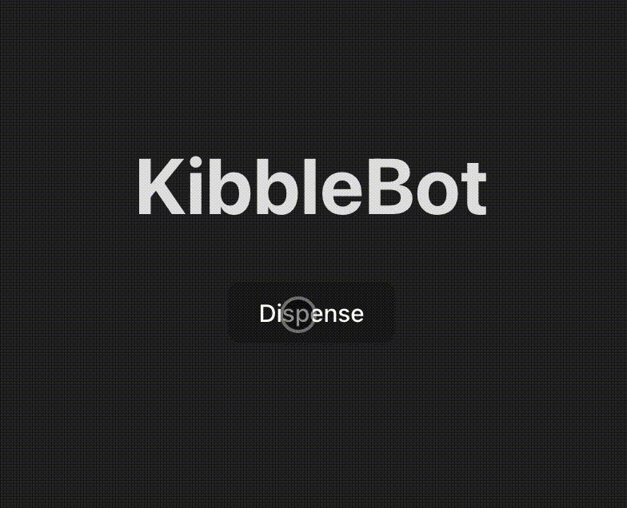