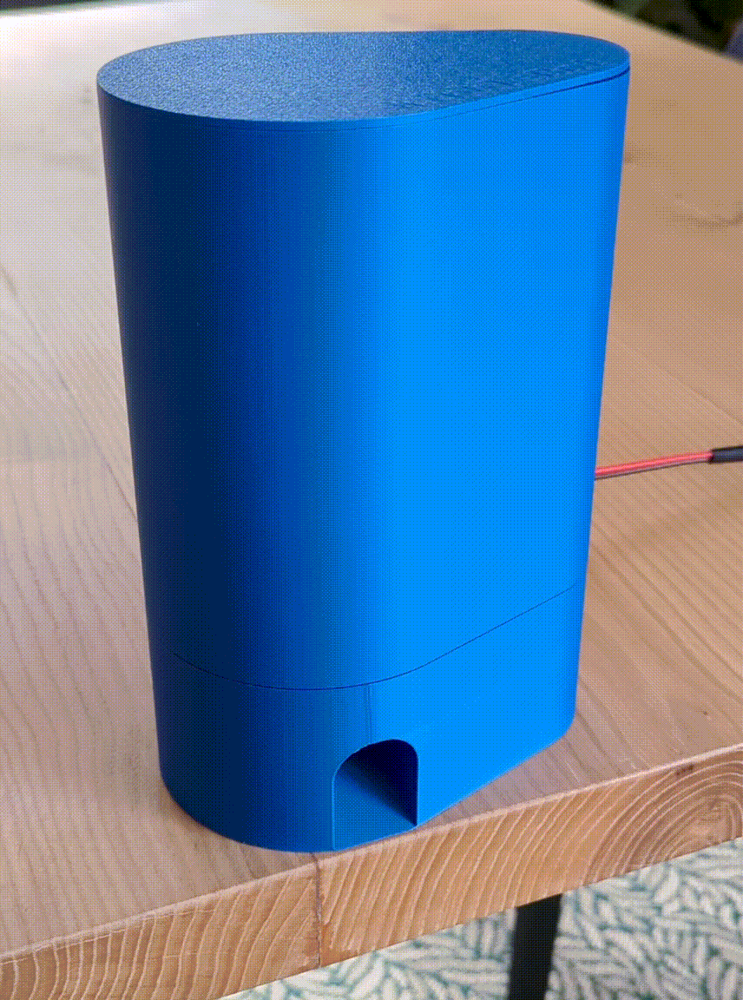
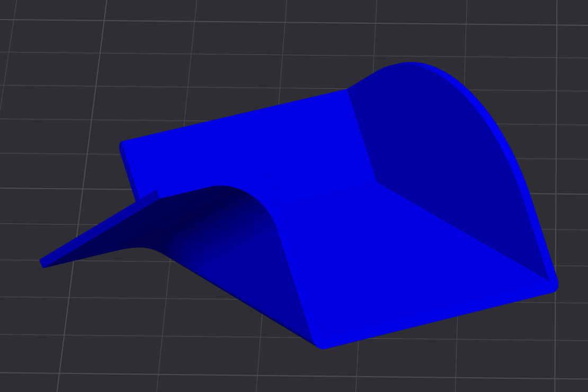
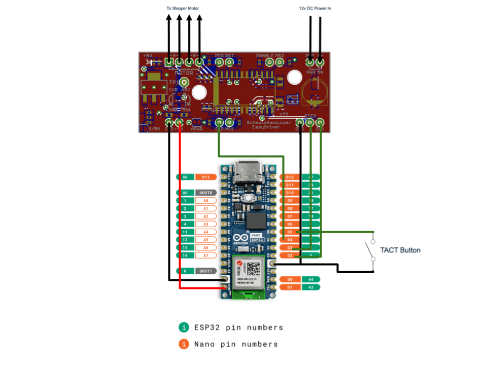
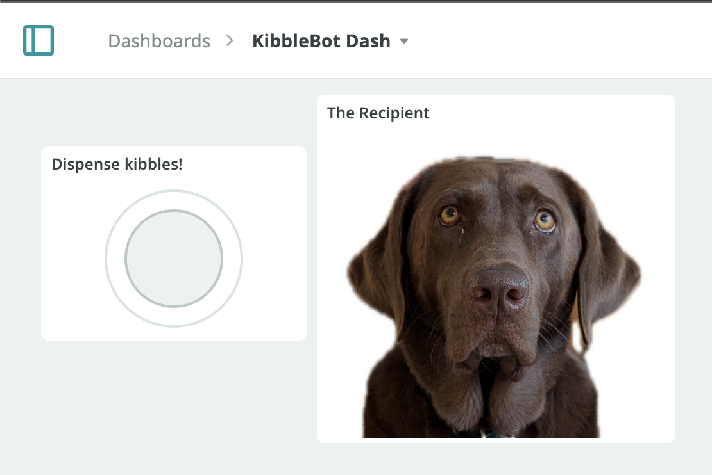
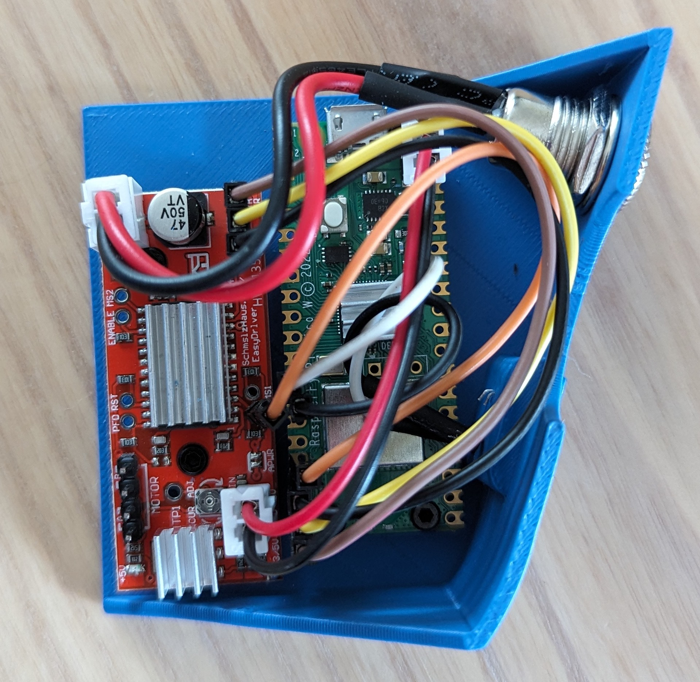
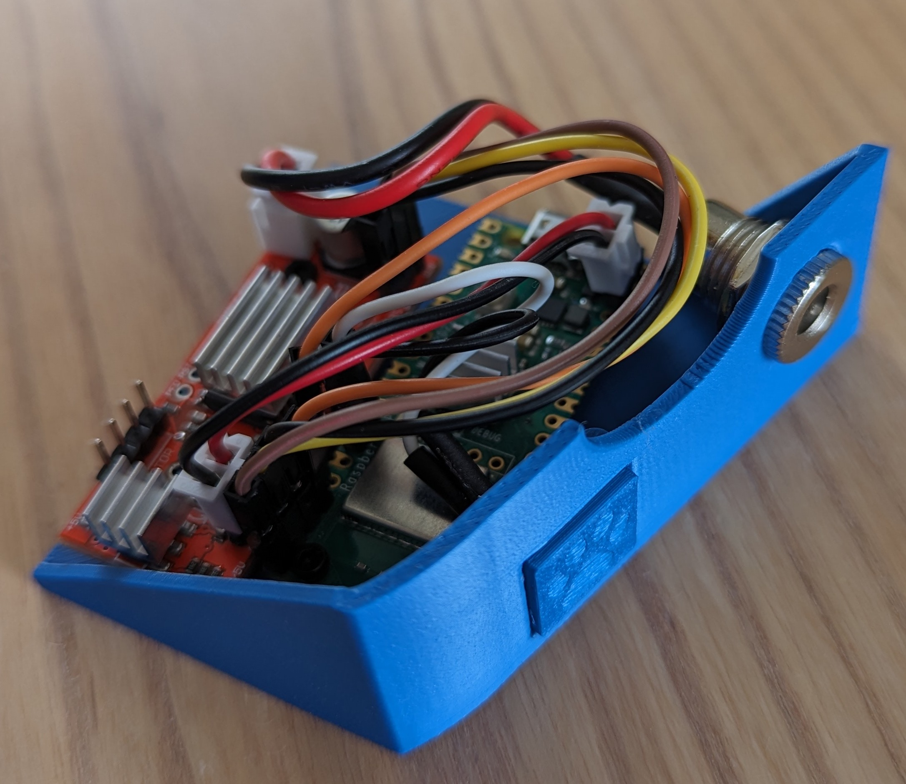

# KibbleBot
A 3D printed kibble/treat dispenser powered by an Arduino Nano ESP32 or a Raspberry Pi Pico W. Give your pet a treat even if you're not home!

**Update 2025-03-01:**
Added Arduino support and instructions for controlling KibbleBot via Arduino Cloud.

**Update 2024-04-10:**
Added a new version of the model which allows KibbleBot to be mounted to a wall and the hopper is now attached more securely using screws.

## Features
- Kibbles dispensed through the push of a button or remotely through a web app (Pi Pico) or Arduino Cloud (Nano ESP32)
- Easy to print and build
- Minimal electronics
- Happy puppers

## Build Instructions
### Parts List
Before you get started, here are all the things you'll need to buy to build your very own KibbleBot. For reference I've included links to the products I purchased:
1. [Arduino Nano ESP 32](https://store.arduino.cc/products/nano-esp32)
1. OR Raspberry Pi Pico W
    - Source from your local [Raspberry Pi authorized reseller](https://www.raspberrypi.com/resellers/)
1. [Easy Driver Stepper Motor Controller](https://ca.robotshop.com/products/easydriver-stepper-motor-controller-a3967)
1. [NEMA 17 Stepper Motor (12V and 350mA)](https://www.pishop.ca/product/stepper-motor-nema-17-size-200-stepsrev-12v-350ma/)
1. 12V Power Supply (I use one I had laying around)
1. [M2x5mm Screws](https://www.amazon.ca/dp/B0C38YFL3D)
1. [M3x6mm Screws](https://www.amazon.ca/dp/B0C38YFL3D)
1. [M3 Flat Washer](https://www.amazon.ca/dp/B0C38YFL3D)
1. [M2x4mm Heat Set Nuts (3.2mm outer diameter)](https://www.amazon.ca/dp/B0CNRSJ1B2)
1. [M3x4mm Heat Set Nuts (4.2mm outer diameter)](https://www.amazon.ca/dp/B0CNRSJ1B2)
1. [6x6x4.3mm TACT Switch Push Button](https://www.amazon.ca/dp/B06Y6DDG8K)
1. [12V DC Barrel Connector (11mm outer diameter)](https://www.amazon.ca/dp/B08SJM2G52)
1. Solder and wire
1. Heat shrink tube
1. [Heat sinks](https://www.amazon.ca/dp/B0814V66JV) (optional, but the Easy Driver can get pretty hot)

### 3D Printed Parts
Print all parts with 0.2mm layer height and 15% infill. I recommend printing both gears with 4 wall loops for some added strength.

I've included [Bambu Studio Project file](docs/models/kibble_bot.3mf) with all parts laid out on two build plates and configured.

|Model|Image|Details|
|-----|-----|-----------|
|[Base Bottom](docs/models/base_bottom.stl)||Base of the KibbleBot which the Base Top and Hopper rest on. It has two holes for each gear to rest in and a third for running the stepper motor wire through. It also contains the chute that kibbles come out of and the cut out for the electronics drawer on the side. Can be wall mounted using the holes on the back.  **Print Orientation**: Right side up **Quantity**: 1 **Supports**: Yes|
|[Base Top](docs/models/base_top.stl)||The Base Top sits inside the Base Bottom covering both gears. It has mounting holes in a 31mm pattern to mount the NEMA 17 stepper motor. You may need to drill out the holes with a small drill bit in order to fit the screws in.  **Print Orientation**: Side up down **Quantity**: 1 **Supports**: No|
|[Large Gear Wheel](docs/models/large_gear_wheel.stl)||The Large Gear Wheel is spun 180 degrees by the Small Gear Wheel allowing kibbles to fall through it and down the chute in the base bottom. It also has two holes for the optional Stir Sticks if you find that kibbles are getting stuck in the Hopper.  **Print Orientation**: Side up down **Quantity**: 1 **Supports**: No|
|[Small Gear Wheel](docs/models/small_gear_wheel.stl)||The Small Gear Wheel is connected to the stepper motor and turns the Large Gear Wheel.  **Print Orientation**: Side up down **Quantity**: 1 **Supports**: No|
|[Stir Stick](docs/models/stir_stick.stl) (optional)||Slots into the top of the Large Gear Wheel and can help with kibbles getting stuck in the Hopper and not flowing through.  **Print Orientation**: Vertical **Quantity**: 2 **Supports**: Yes (brim)|
|[Hopper](docs/models/hopper.stl)||The Hopper sits on top of the Base Bottom and holds kibbles to be dispensed. Contains a cut out so that it will fit over the stepper motor.  **Print Orientation**: Up side down **Quantity**: 1 **Supports**: No|
|[Lid](docs/models/lid.stl)||Sits on top of the Hopper to close it off.  **Print Orientation**: Up side down **Quantity**: 1 **Supports**: No|
|[Electronics Housing](docs/models/electronics_housing.stl)||Houses the Raspberry Pi Pico and the Easy Driver with four holes for the M2 heat set nuts to mount both boards. Also has cut outs for the barrel connector to pass through and to mount the button.  **Print Orientation**: Right side up **Quantity**: 1 **Supports**: Yes|
|[Key Cap](docs/models/key_cap.stl)||The Key Cap is glued on top of the TACT Button and fits inside of a recessed compartment in the Electronics Housing.  **Print Orientation**: Up side down **Quantity**: 1 **Supports**: No|
|[Shute (optional)](docs/models/shute.stl)||Redirects the kibbles off to the left instead of straight down.  **Print Orientation**: Flat side **Quantity**: 1 **Supports**: Yes|

### Assembly
Begin by setting the M3 heat set nuts into the three tabs in the Base Bottom which will hold the hopper in place.

Mount the stepper motor to the Base Top. Pass the ribbon cable through the holes in the Base Top and Base Bottom into the electronics drawer.

Then, assemble the rest of the 3D printed parts like so:

Screw three M3x6mm screws with flat washers through the holes in the Hopper to securely attach it to the Base Bottom.

## Electronics
Below I've provided instructions for two different options for adding smarts to your KibbleBot, either an Arduino Nano ESP32 using Arduino Cloud (easy) or an Raspberry Pi Pico W with a simple web server (a bit more complicated).

### Arduino Nano ESP32
#### Wiring
Since the Nano uses 3.3V logic, the first thing you should do is switch the Easy Driver to use 3.3V logic as well by soldering SJ2 closed (placing a small glob of solder on the two pads on the bottom left hand corner of the board where it's written "5V/3V"). You can confirm you've done this correctly by measuring the voltage across the +5V Output and GND, which should now be 3.3V.

Next, wire the Easy Driver to the Nano as follows:
1. DIR -> D2
1. STEP -> D3
1. SLP -> D4
1. GND -> GND

Connect one side of the TACT Button to D5 and the other side to ground. I used a little bit of CA glue on the back of the button to glue it to the electronics housing, as well as some glue on the back of the keycap to glue it to the TACT Button.

The Easy Driver has a 5V (3.3V) output which can be used to power the Nano. Wire the 5V (now 3.3V) output on the Easy Driver to VIN on the Nano and GND to GND. The Nano's VIN pin can accept an input voltage range of 6-21V, so you could also power it directly from the 12V power supply.

Set the heat set nuts into their holes in the bottom of the housing, and mount both boards using the M2 screws.

Plug in your stepper motor, connect your 12V power supply to PWR IN on the Easy Driver, and you should be all set with the electronics!

#### Code
Begin by following [the instructions](https://docs.arduino.cc/tutorials/nano-esp32/cloud-setup/) on the Arduino website for configuring your Nano ESP32, connecting it to your WiFi, and hooking it up to the Arduino Cloud, and creating a new "Thing".

Once completed, on the Setup tab of your Thing, add a new Read/Write variable called `dispense` of type `boolean`. 

Now select the Sketch tab. The Arduino Cloud IDE will have auto-generated a sketch with some boilerplate code for connecting to WiFi and to the cloud as well as a function called `onDispenseChange()` which will be triggered anytime our `boolean` variable is changed.

Open up `kibblebot.ino` and copy the contents of it into your sketch in the Arduino Cloud. Compile the sketch and upload it to the Nano.

The last step is to create a [Dashboard](https://app.arduino.cc/dashboards) which will tell the Nano to dispense kibbles when a button is pressed. Create a new Dashboard, click the Edit button, then Add, and choose the Button type. Link it to your `dispense` variable and give it a name.

When the button is pressed, `onDispenseChange()` will be called in your sketch via the Arduino Cloud, and kibbles will be dispensed!

### Raspberry Pi Pico
#### Wiring
Since the Pico uses 3.3V logic, the first thing you should do is switch the Easy Driver to use 3.3V logic as well by soldering SJ2 closed (placing a small glob of solder on the two pads on the bottom left hand corner of the board where it's written "5V/3V"). You can confirm you've done this correctly by measuring the voltage across the +5V Output and GND, which should now be 3.3V.

Next, wire the Easy Driver to the Pico as follows:
1. DIR -> GP15
1. STEP -> GP14
1. GND -> GND (Pin 18)
1. SLP -> GP13 

Connect one side of the TACT Button to GP10 and the other to ground (Pin 13). I used a little bit of CA glue on the back of the button to glue it to the electronics housing, as well as some glue on the back of the keycap to glue it to the TACT Button.
+
The Easy Driver has a 5V (3.3V) output which I'm taking advantage of to power the Pico. Wire the 5V (now 3.3V) output on the Easy Driver to VSYS on the Pico, and GND to GND.

Set the heat set nuts into their holes in the bottom of the housing, and mount both boards using the M2 screws.

Plug in your stepper motor, connect your 12V power supply to PWR IN on the Easy Driver, and you should be all set with the electronics!

**Note:** I've opted to solder headers to each board and make the connections using jumper wires. That being said, it's important to make sure the PWR IN and stepper motor connections are solid or you risk blowing up the Easy Driver. Always power off the Easy Driver before plugging/unplugging the stepper motor!

#### Code

The KibbleBot software for the Pico is written in Micropython. Follow the [instructions here](https://www.raspberrypi.com/documentation/microcontrollers/micropython.html) to flash Micropython onto your board.

I also recommend setting up a Visual Studio project and installing the [MicroPico extension](https://github.com/paulober/MicroPico) to copy the code to the board.

You'll also need to have `NodeJS` and `npm` set up on your machine in order to build the web app.

##### main.py

This is the Micropython code which runs on the Pico and interfaces with the Easy Driver to turn the stepper motor and dispense kibbles. It first connects to WiFi and then listens for button presses and has a simple web server to listen for web requests.

To run the code on your Pico, first edit `main.py` and set the WiFi SSID and password. Then connect your Pico to your computer, and wait for VSCode to show "Pico Connected" in the bottom toolbar. Then right click on `main.py` and click "Upload current file to Pico".

##### Web App

I've created a simple Svelte app which `main.py` serves up and allows kibbles to be dispensed from a web browser. The web app is built into a single HTML file to make it easy for the Micropython code to serve up.

You'll need to build the web application and copy the resulting `index.html` to the Pico:
1. Open up a terminal and set the working directory to `/web`
1. Run `npm install`
1. Run `npm run build`
1. Open the resulting `/web/dist/index.html` file
1. Right click on it and click "Upload current file to Pico"

In VSCode, click "Toggle Pico-W-FS" in the bottom toolbar. The "Pico (W) Remote Workspace" view should now show two files: `main.py` and `index.html`.

With both files copied to your Pico, you're good to go! Unplug it from your computer and power everything up with the 12V supply. When the Pico shows a solid green LED it means it's connected to WiFi and ready to go. Navigate to the Pico's IP address in your browser and click "Dispense"!

#### Accessing KibbleBot remotely

If your home router supports running a VPN server, this is likely your easiest option for accessing the KibbleBot when not at home. Simply connect your phone/laptop to the VPN and browse to the local IP address of the Pico.

Another option is a [Cloudflare Zero-Trust tunnel](https://www.cloudflare.com/products/tunnel/), but this requires you to run the Cloudflare client on another machine that's always powered on.

In my set up I've opted to use a Cloudflare tunnel as I already have the Cloudflare client running on my home server and several tunnels configured. This set up enables me to share the URL with friends and family so they can dispense kibbles too. I've included the Micropython code that I use (`main_rate_limiting.py`) which keeps track of the number of kibbles each user has dispensed and limits them to once per week.